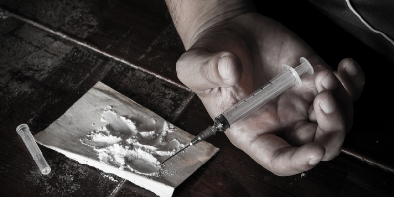

```{r setup, include=FALSE}
knitr::opts_chunk$set(echo = TRUE)
```


## **Part One** 
## Introduction
  

 A drug overdose (overdose or OD) is the ingestion or application of a drug or other substance in quantities greater than are recommended(1). Typically it is used for cases when a risk to health will potentially result.An overdose may result in a toxic state or death.According to the Centers for Disease Control(CDC),a total of 93,422 death from a drug overdose in the US last year.drug overdose is mainly due to Usage of illicit drugs,in large quantities.
 I am interested in analyzing this type of data and dressing several  questions:
  -what are the top 5 drug cause death?  
  -what is the country associated with more death  
  -who dies more male or female?   


## **Part Two** Exploring the dataset

### Used  libraries 
Packges   | Used for 
--------  | --------
Tidyverse | Collection of R packages designed for data science.
Skimr     | provide summary statistics about variables.
Naniar    | Identifying missing values 

```{r Load libraries,  include=FALSE}

library("tidyverse")
library("skimr")
library("naniar")
library("kknn")
library("VIM")
library ("recipes")

```

### Importing Dataset
```{r}
drug_death <- readr::read_csv("data/drug_deaths.csv")
```

### Summary
```{r}
summary(drug_death)
```

### Identifying missing values

```{r}
#Number of missing values
n_miss(drug_death)
#
vis_miss(drug_death)
  
 
#Visualization for missing data using nainar package:
gg_miss_var(drug_death)

#missing data using skmr package
drug_death %>% skim() %>% filter(n_missing != 0) %>% 
  ggplot( aes(x = fct_reorder(skim_variable, n_missing), y = n_missing, fill = skim_variable, label = n_missing))+
  geom_col()+
  geom_text(size = 3.5, hjust = -0.25, vjust = 0.25 )+
  coord_flip()+
  theme(axis.text.x = element_text(angle = 90))+
  scale_y_continuous(expand = expansion(add = c(0, 500))) +
  theme(legend.position = "none")+
  labs(
    title = "Missing Data distribution using skimr package",
  )
```  

#### Comments on missing values 
Thinking of missing values for most two missed column is simply because there is no "other","other significance".so originally these data are not missing, simply they could be replaced with "no"  


### Making Tidy data
```{r}
drug_death %>% 
  pivot_longer(c(Heroin,
                  Fentanyl,
                  Fentanyl_Analogue,
                  Cocaine,
                  Oxycodone,
                  Oxymorphone,
                  Morphine_NotHeroin,
                  Ethanol,
                  Hydrocodone,
                  Benzodiazepine,
                  Methadone,
                  Amphet,
                  Tramad,
                  Hydromorphone), names_to = 
                 "Drug_name", values_to = "values") -> drug_death_long
dim(drug_death_long)
```


## **Part Two**: Adressing Research Questions:

### How many femals and males died due the drug overdose?

```{r}
drug_death %>% group_by(Sex) %>% 
  count()
```

### Who died more due to Heroin toxicity? males or females?

#### 2sample test
t.test(Heroin ~ Sex, data = drug_death)

- According to national institute of drug abuse "Men are more likely than women to use almost all types of illicit drugs"(3)
### what are the top 5 drug cause death?

drug_death_long %>%
 
  group_by(Drug_name) %>%
  summarise(Count = sum(values)) %>%
  top_n(5) 
 #### plotting
```{r}
drug_death_long %>%
  group_by(Drug_name) %>%
  summarise(Count = sum(values)) %>%
  top_n(5) %>%
ggplot(aes(
  x = Drug_name,
  y = Count,
    label = Count,
    fill = Drug_name
  )) +
  geom_col(width = 0.8) +
  scale_y_continuous(expand = expansion(add = c(0, 600))) +
  geom_text(hjust = -0.1, size = 3.5) +
  coord_flip() +
  theme(legend.position = "none") +
  theme(axis.text.x = element_text(angle = 90)) +
  labs(
    title = "What are most popular  causing Death ?",
    subtitle = "Plot Top 5 drugs ",
    x = "Drug Name",
    y = "Count"
  )
```
 


#### P-value : signifcant differnce among drugs 
```{r}
 druganova1 <- aov(values~Drug_name,data=drug_death_long)
summary.aov(druganova1)

with(drug_death_long,pairwise.t.test(values,Drug_name, 
                                    p.adjust.method = "BH"))
TukeyHSD(druganova1)
```


### What are the most country cauesed death related to drug name?


 
## **Part Three** Conclusion and References 
### Conclusion
 Unfortunately, most of the medication is opioids, it is a sad story when starts just for joy and euphoria to addiction until death. 
Generally, treatment will use a combination of behavioral therapy interventions and medications to reduce the person's need or desire for the drug and give the person the skills to refrain from future drug use, notes the National Institute on Drug Abuse(4).

### References

(1)Overdose - Florida Center for Recovery. (2021). Retrieved 20 October 2021, from https://www.floridacenterforrecovery.com/glossary/overdose/  
(2)Drug Overdose Deaths | Drug Overdose | CDC Injury Center. (2021). Retrieved 20 October 2021, from https://www.cdc.gov/drugoverdose/deaths/index.html  
(3)NIDA. "Sex and Gender Differences in Substance Use." National Institute on Drug Abuse, 13 Apr. 2021, https://www.drugabuse.gov/publications/research-reports/substance-usein-women/sex-gender-differences-in-substance-use Accessed 16 Oct. 2021.  
(4)https://healthfully.com/what-are-some-solutions-to-drug-abuse-4616383.html  
